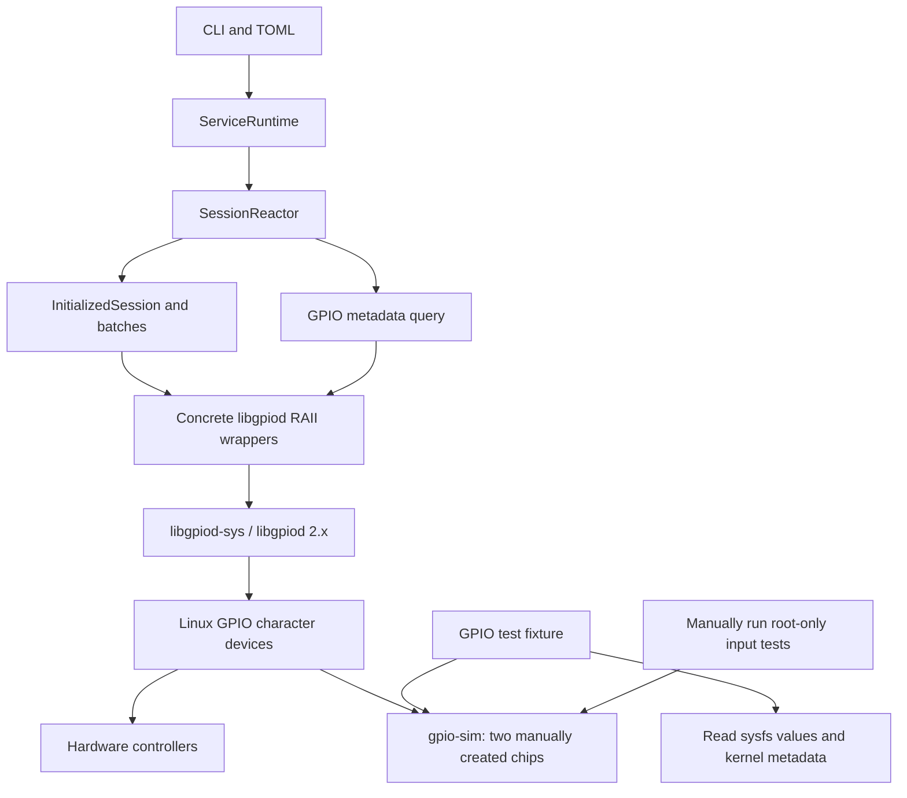

# Architecture proposal: one libgpiod implementation, gpio-sim for tests

Updated: 2026-10-10. **Design only; feasibility passed for the agreed scope in [the feasibility report](gpio-sim-test-feasibility.md).** No implementation changes are included. The user has resolved omitted-initial semantics (unspecified value), input-injection permissions (manually run root-only cases), and stepped-set observations (concurrent value checks with generous intervals). Dedicated `final`-value tests are deferred to [TODO](../docs/TODO) and no longer block the refactor.

## Intended structure

Use the same concrete system libgpiod wrapper in production and GPIO integration tests. gpio-sim is a kernel device fixture, not a replacement Rust backend. Device paths in TOML select real hardware or the manually prepared simulation, using identical production code.



The service must not know about configfs, simulation state JSON, topology setup, XML files, test locks, input-injection helpers, or test skip policy. Those belong to development/test support. Production still resolves **exact pin-map keys** to the configured `(device, line)`; labels and spelling are never a substitute for that mapping.

## Concrete GPIO module

Keep the existing `src/gpio/sys/{chip,config,convert,request}.rs` implementation initially to minimize FFI churn. Replace `src/gpio/mod.rs`'s backend interface with a small module facade and data types. Remove `src/gpio/mock/` completely from active code.

Proposed file organization:

```text
src/gpio/
  mod.rs           module facade / concrete re-exports
  types.rs         GPIO values, directions, bias, drive, clocks, event types
  error.rs         GPIOError
  sys/
    mod.rs         concrete exports, API version / device predicate
    chip.rs        chip, chip info, line info, info event
    config.rs      line settings, line config, request config
    request.rs     line request, edge buffer, borrowed edge event
    convert.rs     checked FFI conversions
```

Remove all eleven GPIO traits: `Backend`, `Chip`, `ChipInfo`, `LineInfo`, `InfoEvent`, `LineSettings`, `LineConfig`, `RequestConfig`, `LineRequest`, `EdgeEvent`, and `EdgeEventBuffer`. Move their system implementations to inherent methods on the existing `Sys*` structs. Change trait-associated return/argument types to concrete types and preserve edge-event borrows tied to the buffer. Retain standard-library traits such as `Drop`, `AsRawFd`, and the existing justified `Send` implementations; do not add `Sync` merely to make a new type arrangement compile.

Remove the stateless `SysBackend` factory too. Replace its methods as follows:

| Current factory | Concrete API |
| --- | --- |
| `backend.open_chip(path)` | `SysChip::open(path)` |
| `backend.new_line_settings()` | `SysLineSettings::new()` |
| `backend.new_line_config()` | `SysLineConfig::new()` |
| `backend.new_request_config()` | `SysRequestConfig::new()` |
| `backend.new_edge_event_buffer(capacity)` | `SysEdgeEventBuffer::new(capacity)` |
| `backend.is_gpiochip_device(path)` | module function `is_gpiochip_device(path)` |
| `backend.api_version()` | module function `api_version()` |

Expose the constructors at the visibility required by callers. Keep raw FFI access within the wrapper. Keeping the `Sys*` names for this refactor avoids mixing a broad rename into the functional migration; there is no remaining polymorphic GPIO interface behind those names.

Keep `LineValue` and `ValidLineValue`, ABI layout assertions, checked conversions, enums, and error types. They are part of the safe wrapper, not an unnecessary backend interface. Retain concrete length validation and the distinction between a valid output bit and the FFI error sentinel.

## Application and session changes

| File / component | Proposed change |
| --- | --- |
| `src/main.rs` | Parse CLI, load configuration, and start the one service path. Remove `MockMode::from_cli`. |
| `src/app.rs` | Delete `Cli.mock`, `MockMode`, `SelectedBackend`, `select_backend`, mock validation, XML snapshot cache, and mock-log environment handling. |
| `AppConfig` | Prefer passing `ServiceConfig` directly after its only extra field disappears. |
| `ServiceRuntime<B>` | Become `ServiceRuntime`; delete its `Arc<B>` and the backend constructor argument. |
| `SessionChip<B>` | Store `SysChip` and `SysLineRequest` directly. |
| `InitializedSession<B>` | Store concrete chips and `SysEdgeEventBuffer`; remove backend parameters. |
| `GPIODChipData<B>` | Store `SysLineConfig`; remove its generic parameter. |
| `SessionReactor<B, W>` | Become `SessionReactor<W>`; remove backend ownership and pass configuration directly. |
| `apply_get_batch`, `apply_set_batch` | Accept concrete initialized sessions; preserve batch ordering and checks. |
| `collect_gpio_info` | Open concrete chip handles; preserve selection, exact keys, IDs, and metadata schema. |
| `SessionConfig`, response sink / transport abstractions | Keep. These are configuration/transport interfaces, not competing GPIO implementations. |
| `CompiledPins`, `ChipIndices<T>`, sequence scheduling | Keep useful non-backend generics and pure algorithms. |

Requests remain session-owned: one chip request per configured device group, released with RAII. Do not introduce a process-wide shared GPIO request/cache to replace the mock cache. Kernel exclusivity is authoritative, including external consumers.

Keep the existing query behavior of opening selected devices without reserving lines. The test named `resolves_all_names_before_io...` does not currently prove that behavior: the implementation and assertions allow an early I/O failure. Rename the test to reflect actual behavior rather than quietly changing error precedence during this refactor.

### Startup validation and errors

Keep failure before socket binding for invalid devices. To retain the useful mock startup missing-line coverage, extend concrete startup validation to open each distinct configured chip, read its line count, and validate every mapped offset. This is a deliberate tightening of current real startup behavior, which only checks that paths are GPIO devices. It must not request lines; a valid busy line is still a valid configuration.

Keep initialization-time validation as well because chips can disappear or change after startup. Validate configured offsets against chip info before requesting, so offset 99 produces a contextual `MissingLine` instead of relying on errno to identify which offset failed. Do not reinterpret every `EINVAL` as a missing offset; it can mean invalid line settings too.

Delete `MockLogWithoutMock`, `MockWriteLogUnavailable`, and `InvalidChipFile`. Keep or adapt contextual unavailable-device, invalid-device, and missing-line errors with underlying I/O causes where useful. Preserve JSON envelopes and request correlation. Busy-line tests should assert the failure class/errno and ownership behavior, not mock-specific prose.

### Edge readiness and teardown

This needs more than mechanical removal of `B`:

1. The existing watcher posts `GpioReady` messages from fd readiness; duplicate notifications may survive after the first one drains the request.
2. Before every potentially blocking `read_edge_events`, call the concrete request's zero-time wait. Return on timeout. Keep a single reader of each request and bound each drain batch.
3. Delete the mock-specific `GPIOError::Other` substring check for `"no edge events"`.
4. Stop and await readiness tasks before releasing the request fd. The existing borrowed `UnownedFd` must not remain registered after its owner is dropped; audit cancellation/registration ordering during this change.
5. Exercise a stale readiness notification with a valid initialized trigger request. The current pre-init no-op test does not cover this risk.

Keep sequence cancellation and final-write-before-release ordering during all existing graceful-close paths. SIGKILL cannot promise final writes and should remain a harness emergency cleanup only.

## Protocol decisions that must be explicit

### Omitted initial

**User decision:** when `initial` is omitted from `init`, the output value is not guaranteed. Tests must not assert that pin's output value until its first explicit `set` has been applied. Do not promise preservation or logical inactive; libgpiod's default remains an implementation detail.

Update the README and protocol documentation during implementation. Rewrite the existing preservation cases to initialize without `initial`, verify init succeeds, perform an explicit set, and then check the resulting output. In combined entries, apply this rule per pin: setting one pin does not establish the value of another. Tests needing a known level immediately after init must provide `initial`; explicit initial-value and broadcast tests remain valid. No preservation mechanism, simulator-specific production logic, or forced default contract is needed. This decision resolves feasibility point 1.

### Final values

Keep the contract: apply configured finals on graceful close, then release ownership; omitted `final` skips an explicit close write. Do not promise a retained physical level after release.

The [direct C-ABI experiment](gpio-sim-release-experiment.md) confirms that both existing gpio-sim chips follow the current pull as soon as their request is released. Keeping only the chip handle open does not preserve the written value; the line request must remain alive for pre-release observation. Real hardware has no general API guarantee of either retaining the last value or restoring the pre-request value after release.

**User decision on 2026-10-10:** defer dedicated `final`-value testing to [TODO](../docs/TODO), including migration of final-specific batch/broadcast cases. Preserve production final application and close ordering. Retain shutdown, socket cleanup, ownership release, and re-acquisition tests; split mixed cases to keep their non-final assertions. Existing protocol parsing/validation coverage can remain. No final-application test seam or extra observation infrastructure is required in this refactor.

For the future TODO, consider a concrete final-application method that can be checked while retaining the line request, and a pre-release recording mechanism if full close-path proof is needed. The accepted 500 ms set-step plan does not resolve this because close immediately releases the request. Retained final-only tests must be explicitly ignored with a TODO reason; removed mock-dependent cases remain tracked in the inventory. Do not count deferred coverage as passing or add a production teardown delay solely for tests.

## Test organization and runtime skips

Introduce a small `src/lib.rs` for the existing production modules and make `main.rs` a thin executable entry point. This permits integration tests to call concrete session and wrapper APIs without duplicating source through `#[path]` includes. Expose only the items needed for the service and tests; this is not a commitment to publish a stable general-purpose GPIO library. Private algorithm tests remain alongside their modules.

Proposed test layout:

```text
src/**                 pure unit tests, ordinary Rust harness
tests/cli.rs           device-free executable argument/config errors
tests/gpio_sim.rs      custom runtime-skipping integration target
tests/smoke.rs         custom runtime-skipping executable/UDS target
tests/support/
  gpio_sim.rs          discovery, capabilities, lock, physical observations
  service.rs           temporary config/socket, subprocess and RPC lifecycle
  cases/               migrated GPIO/session cases grouped by behavior
```

Use a dev dependency on a pinned compatible `libtest-mimic` release and `harness = false` for the two device-dependent targets. Register named cases with `Trial::ignorable_test`; return a real ignored completion with a reason when prerequisites are missing. A per-case Tokio runtime can drive existing async test bodies. Keep synchronous fixture/lock acquisition outside the Tokio executor. Ensure listing/filtering works without mutating GPIO. This runner supports runtime ignoring; ordinary compile-time `test-with` path checks are not sufficient for manually started/stopped devices. [Runtime trial API](https://docs.rs/libtest-mimic/latest/libtest_mimic/struct.Trial.html).

For input-injection cases, check `nix::unistd::geteuid().is_root()` at execution time and report a named root-required ignore for a normal user. Add nix's `user` feature for test support. Also check topology and actual access to the pull controls. Runtime gating allows the same normally built executable to run its input cases when manually invoked as root. Do not use environment variables as a substitute for the effective UID.

`test-with` runtime mode is a valid alternative: `#[test_with::runtime_root()]` is supported with runtime/user features and the runner/module arrangement. Its ordinary `#[test_with::root()]` makes the decision during compilation and is unsuitable for this workflow. The service itself should acquire no test-runner dependency. [Root macro implementations](https://docs.rs/test-with-derive/latest/src/test_with_derive/lib.rs.html).

### Fixture contract

The fixture consumes the existing `/run/gpiojsonsvc-gpio-sim/state.json` and verifies it against the live system, rather than trusting cached strings. Use stable links for service configuration and verified resolved sysfs paths for observations. Verify the simulator's driver/provenance, two expected banks, eight lines each, access permissions, and exact line names. Honor the development document's restriction to hosts without hardware GPIO controllers. Never fall back to the first `/dev/gpiochipN` that happens to exist.

The fixture offers two capabilities for the current refactor:

| Capability | Prerequisites | Cases |
| --- | --- | --- |
| Basic GPIO | Verified character devices, metadata access, readable physical values | Requests, outputs, queries, ownership, most session/smoke cases |
| Input injection | Basic plus effective UID 0 and writable verified simulator pull controls | Manually run trigger events, edge filtering, event-fd drain/readiness |

Missing basic or injection capability is a named skip in normal development. Proposed strict environment options `GPIOJSONSVC_REQUIRE_GPIO_SIM=1` and `GPIOJSONSVC_REQUIRE_GPIO_SIM_INPUT=1` turn required missing capabilities into failures; use the input requirement for the manually selected root run so it cannot silently skip every requested case. Root alone does not imply writable sysfs, especially inside containers. A test that starts with a valid fixture and then encounters an I/O error fails; it must not reinterpret implementation failures as unavailable simulation. Expected invalid-device tests run without this gate.

Use one advisory file lock, shared across test processes, for the pair of chips. Hold it from preparation until every request and subprocess is released/reaped. Key the lock by topology, **not effective UID**: normal-user and sudo runs must contend for the same lock. Its location and permissions must allow both to open it; verify root-first and user-first execution orders. On local Linux filesystems a persistent readable lock file can be opened read-only and exclusively flocked, avoiding a root-created writable-file requirement. Use the existing `nix` filesystem support or another deliberately chosen implementation. An in-process mutex can coordinate sibling cases, but does not replace the file lock. Set a bounded acquisition timeout and diagnose competing users of the topology.

Preparation happens after acquiring the lock. Check for unexpected consumers and fail rather than killing them. Configure each test's direction, bias, drive, and polarity deliberately. Supply an explicit output initial value when the test needs a known level before set; omitted-initial cases must defer value assertions until their first set. Save/restore pulls for tests that change them; use a held input request with deliberate bias for deterministic static inputs where appropriate. Release service requests before cleanup requests. Never reset/recreate the topology as a test cleanup strategy.

### Manual root-only execution

The existing `tools/gpio_sim_dev.py` remains a manual development helper. Its current `start/reset/stop/set` commands require root, while `get/status/dump` do not. The user has selected manual root execution for the input-injection tests. This supersedes the earlier proposal for a privileged broker or extra pull-control permissions.

Build with `cargo test --no-run` as the normal user. Run ordinary tests normally. For input cases, manually invoke the exact compiled test executable with sudo and the relevant test-name filter, retaining the repository working directory for helper paths. Give input cases a consistent name prefix such as `root_input::` so they can be selected without rerunning every case as root. The documented command must use Cargo's emitted executable path (or its JSON artifact output), not a glob that could select stale builds. Cargo supports `--no-run`. [Cargo test options](https://doc.rust-lang.org/cargo/commands/cargo-test.html).

The root test process can invoke the existing `set` helper without nested sudo, or directly manipulate the verified pull files. A child service inherits root in that manual test run unless the harness explicitly changes its identity; ordinary basic/smoke runs still exercise the non-root service. Keep temporary outputs in per-run directories so a root run does not leave build artifacts owned by root. Tests never auto-elevate and never create/reset/stop the user's topology. No permission installation or root execution has been performed in this document-only research.

## Smoke harness replacement

Keep temporary TOML and a unique temporary Unix socket per service process. Replace `spawn_mock` with a harness that acquires the verified fixture and starts the normal binary with only the config path. Never share `/tmp/gpiojsonsvc-gpio-sim.sock` with a manually running development service.

The representative smoke pin map should preserve opaque names and IDs:

| Protocol key | ID | Device | Line |
| --- | ---: | --- | ---: |
| `gpiochip0:0` | 0 | stable gpiochip0 link | 0 |
| `gpiochip0:7` | 7 | stable gpiochip0 link | 7 |
| `GPIO1_B5` | 26 | stable gpiochip1 link | 5 |

Do not change `GPIO1_B5` into a parseable hardware address. The actual simulator line name remains `gpiochip1:5`, independent of the service key.

The harness should capture stderr, monitor premature child exit while waiting for socket readiness, and bound RPC/close waits. Gracefully shut down and await the child on success; on failure, kill **its own** child and reap it before releasing the fixture lock. `start_kill()` without waiting, as in the current harness, is insufficient for reliable reuse of shared chips. Sanitize inherited service config environment to keep tests independent of the developer's shell.

Port the eight non-CLI smoke cases from the named inventory using physical sysfs observations while requests are alive, fresh line metadata for ownership, and explicit initial/input fixture setup. Preserve multi-client query/conflict/retry behavior and cross-chip validation-before-write checks. Move the five CLI-focused cases to device-free CLI coverage: retain useful config/help/error checks and delete the mock flag/log behavior. Add a real trigger-event smoke case marked for manual root execution; current smoke coverage has no such case.

For sequences, use the accepted concurrent-observer plan with **500 ms test lags** initially (200–500 ms is the intended range), and no narrow timing tolerances. A two-step example starts with explicit initial 0, sets 1 immediately, then sets 0 with lag 500 ms. Start the observer and await its ready signal before sending the request; poll the verified sysfs value every 10–20 ms to record H followed by L. Independently await the correlated `ok`, then verify physical L with ownership still held. Give the operation a generous total timeout such as 3 seconds. A read around 500+ ms is useful, but completion/eventual-value checks replace an assertion tied to exactly 500 ms.

For more steps, require each distinct adjacent value pattern in order. Keep both the observer and service running until the last observation is verified. Prefer direct sysfs sampling to repeatedly launching Python. A separate thread avoids sharing a blocked async worker, although severe host descheduling can still miss a finite plateau; use generous lags and report observation failures. Final level alone must not satisfy an intermediate-step assertion. Identical repeated writes and precise write timing/counts are outside this functional check; retain pure compilation/order tests. Multi-chip reads are not an atomic snapshot. A normal output cannot be observed by a second `gpiomon` request on the same line. Do not test close-time `final` by reading only after releasing GPIO.

## Dependencies, assets, and documentation

| Item | Planned action |
| --- | --- |
| `quick-xml` | Remove: active uses belong to mock parsing/state. |
| `inotify` | Remove if confirming no newly introduced use; current uses are only in archived code. |
| `nix` | Keep errno and signal needs; remove mock eventfd use. Retain test locking/polling features and add `user` for the runtime effective-UID check. |
| `libgpiod-sys`, `pkg-config`, build prerequisites | Keep. Runtime test skips cannot bypass compile/link requirements. |
| `build.rs` | Make Linux support statement consistent; current warning about compiling without libgpiod-sys on non-Linux contradicts the unconditional dependency. Do not promise portable no-device builds. |
| `tempfile`, Tokio | Keep for configs/sockets, device-free tests, and async service tests. |
| `libtest-mimic` or chosen runtime test runner | Add under dev dependencies only. |
| `assets/mock/` | Prefer rename to `assets/gpio-sim/`; these newly added files already describe gpio-sim, not XML. Update helper defaults and all references together. Do not discard the user's staged work. |
| `docs/mock_chip.md` | Remove from active documentation or clearly archive as historical. |
| README, architecture/protocol/development docs, debug-client examples, AGENTS guidance | Remove mock invocation/setup guidance; document new commands, build requirements, conditional skips, and chosen initial/final semantics. |
| `systemd/` and Rock5B config | Audit references; the real-device invocation and exact pin map should continue working. |
| `src/_archived/` | Leave historical, uncompiled code alone unless separately requested; exclude it when asserting active mock removal. |

## Implementation order and completion criteria

1. **Apply the resolved policies and prove prerequisites.** Use unspecified values for omitted initial, manually run root-only injection cases with runtime permission checks, and use concurrent 500 ms stepped-set observations. Track dedicated final-value tests as deferred TODO work; keep close/release behavior covered. Characterize the remaining kernel/wrapper behaviors using existing prepared chips. Do not start by deleting useful assertions.
2. **Build test support.** Add runtime capability checks, true skip reporting, shared fixture locking, and bounded process cleanup. Prove that the same built runner responds correctly when the user manually prepares/removes devices.
3. **Expose concrete wrapper methods.** Preserve RAII, lifetimes, value ABI tests, and argument validation. Migrate useful low-level mock semantics to the real wrapper and retire only the enumerated implementation-only cases.
4. **Remove backend generics and selection.** Convert application/session code to concrete types; fix offset classification and stale readiness; remove the mock tree and unused dependencies.
5. **Migrate session and smoke coverage.** Preserve pure tests, migrate each retained behavior from the inventory, add trigger smoke and stale-readiness coverage, and explicitly track deferred final-value coverage. No final-value test is required for current acceptance.
6. **Update user-facing contracts and run acceptance.** Synchronize docs/assets and verify the normal real-device CLI remains supported.

Acceptance includes `cargo fmt --check`, `cargo build`, `cargo test`, both Python suites, and strict prepared-simulator runs of both custom test targets. Verify absent-device and non-root input paths report named ignored tests, while strict mode fails. Execute the same compiled input cases manually as root and verify they actually run. Check the set-step observer sees intermediate values and the last step value without exact timing requirements. `final`-value tests remain explicitly deferred and do not block acceptance. Exercise concurrent root/user test invocations to validate the shared lock and cleanup, and re-run cases after a failed child to detect leaked requests. No simulator-dependent test may silently return success without exercising its assertions.

The refactor is ready to merge only when every retained inventory entry has a replacement or an explicitly accepted change in coverage/contract. The baseline's 227 passing Rust tests is useful evidence, but matching that numeric count is not the goal: deleted XML/log tests disappear, while the remaining suite must test the concrete service accurately.
