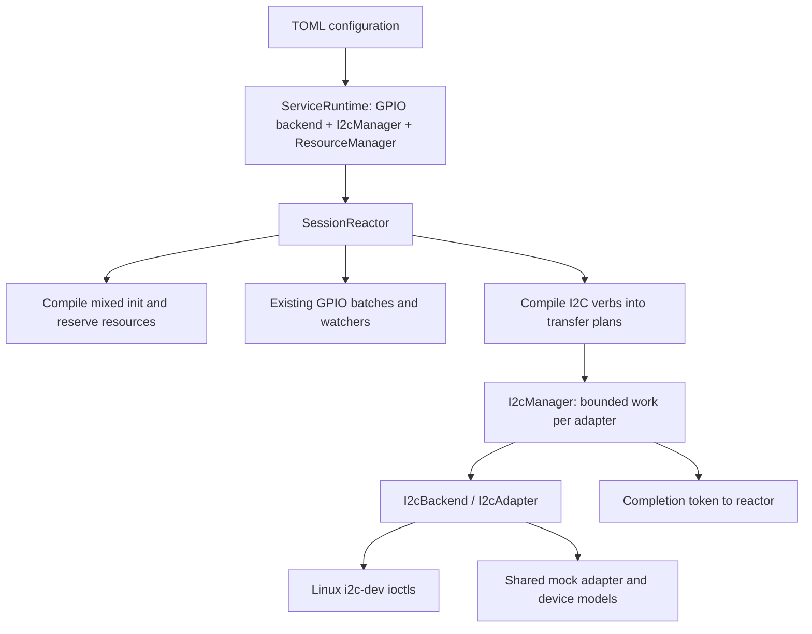

# Proposed I²C architecture and configuration

Status: draft for review. See [decisions](i2c-design.md).

## Current implementation and required changes

The current `gpio::Backend` trait mirrors libgpiod objects. `ServiceRuntime<B>`,
`SessionReactor<B,W>`, and `InitializedSession<B>` carry that GPIO backend;
initialization compiles only GPIO pins. `SessionConfig` exposes only the GPIO
map. The required GPIO `id` is currently metadata, while location conflicts use
`(device,line)`. `LinesCodec::new()` currently has no explicit frame bound.

Keep the existing GPIO backend trait. Add an independent I²C trait and a shared
service context instead of putting transfer methods on GPIO chips or lines.



Suggested module responsibilities:

| Path | Responsibility |
| --- | --- |
| `src/config.rs` | `I2cBusSpec`, maps, limits, config identity validation. |
| `src/resource.rs` (new) | Process-wide atomic resource acquisition and RAII lease release. |
| `src/i2c/mod.rs` (new) | Byte messages, capabilities, backend/adapter traits, errors. |
| `src/i2c/manager.rs` (new) | Shared adapter registry, worker lifecycle, bounded submission. |
| `src/i2c/sys/` (new) | Linux descriptors, UAPI wrapper, capability/probe/transfer calls. |
| `src/i2c/mock/` (new) | Fixture loading, shared state, device models, trace/fault injection. |
| `src/protocol/i2c.rs` (new) | Request forms and codecs; no OS calls. |
| `src/session/i2c.rs` (new) | Resolve initialized bus, compile/validate plans, format results. |
| Existing `session` modules | Mixed init, I²C completion handling, close coordination. |

Keep GPIO generics; inject an `Arc<I2cManager>` using `Arc<dyn I2cBackend>` for
I²C. This avoids a second generic parameter throughout the existing GPIO tests.
`--mock` selects both mock backends; real mode selects both system backends.
Hybrid real/mock selection is deferred. Extend `SessionConfig` with I²C lookup
and map access, with empty defaults for existing GPIO-only test maps.

## Configuration

```toml
[service]
socket = "/run/gpiojsonsvc/service.sock"

[pins.gpiod]
"GPIO0_B5" = { id = 8, device = "/dev/gpiochip0", line = 13 }
"GPIO0_B6" = { id = 10, device = "/dev/gpiochip0", line = 14 }

[pins.i2c]
"I2C_1" = { device = "/dev/i2c-1", sda = 10, scl = 8, allow_scan = false }
```

`I2cBusSpec` has `device: String`, `sda: u32`, `scl: u32`, and
`allow_scan: bool` defaulting to false. `pins.gpiod` and `pins.i2c` both default
to empty; require at least one mapping across them. An I²C-only installation
does not need artificial GPIO mappings for its SDA/SCL IDs. IDs are explicit
board resource identifiers, not inferred GPIO numbers.

Rules:

- Names are exact, non-empty strings with the existing `|` and `lag`
  restrictions. An I²C name cannot duplicate a GPIO name, making a mixed init
  and future subsystem routing unambiguous.
- `device` is non-empty; `sda != scl`. Validate all mappings at startup.
- Where GPIO IDs are reused by I²C, they refer to the same board resources.
  For configs containing I²C, GPIO aliases of one canonical location must have
  one ID, and one GPIO ID must not describe multiple canonical locations.
  GPIO-only configs keep today's metadata rules.
- Canonical Linux adapter identity comes from the opened character device's
  device number (`fstat`/`st_rdev`), not the path spelling. Mock identity comes
  from the canonical fixture path. GPIO physical keys similarly use canonical
  chip identity plus offset for the resource registry. Reject path aliases with
  contradictory SDA/SCL assignments; aliases with identical assignments share
  ownership and worker state. Selecting both aliases in one init is an error.
- Distinct adapters may have overlapping SDA/SCL IDs in config to describe
  mutually exclusive board routes; their leases conflict. V1 does not model
  shared physical wires behind I²C muxes or enable those routes dynamically.
- Default limits: 42 messages/transfer, 4096 bytes/message, 16384 total read plus
  write bytes/transfer. These are service limits, not an adapter guarantee.
  Use fixed v1 constants, exposed by query; changing them is a future option.

Startup opens each configured I²C adapter and inspects its capabilities without
probing addresses. Missing/unopenable adapters and invalid mock fixtures fail
startup, matching GPIO's fail-fast behavior. An SMBus-only adapter can be listed
and scanned when supported; raw operations report unsupported. Retain opened
adapter identity for the service lifetime; after removal, report errors rather
than automatically attaching to a possibly different replacement device.

For mock mode use `device = "/path/to/i2c-1.mock.toml"` in a separate config,
following the existing GPIO convention of substituting fixture paths. No GPIO
XML grammar change is required. The fixture format is in [backends](i2c-backends.md).

## Resource ownership

Exclusive bus ownership per session is the accepted D1 decision. The lease
mechanics below remain part of the implementation design under review.

Use one `ResourceManager` shared by all sessions and both subsystems. Leases
are service policy; libgpiod/kernel checks remain additional constraints.

| Request | Resource keys acquired exclusively |
| --- | --- |
| GPIO init, any existing mode | Physical GPIO `(chip identity,line)` and `PinId(id)` when I²C mappings are configured. |
| I²C init | `I2cAdapter(identity)`, `PinId(sda)`, `PinId(scl)`. |

Existing GPIO line requests are exclusive even for input; this proposal does
not implement the separately deferred shared-input feature. Check the complete
mixed resource set under a short registry mutex, then reserve all or none.
Deduplicate identities and reject conflicting entries inside the same init.
Do not hold the registry mutex while opening hardware or executing requests.

Suggested service interface: `try_acquire(session_id, resource_set) -> Lease`.
The non-cloneable lease releases on drop. An I²C job owns a guarded reference to
its session lease, keeping claims alive through a disconnected in-flight call.
Read-only metadata queries need no lease and cannot reserve resources.

`sda/scl` do not imply libgpiod requests. Requesting those GPIO lines while the
adapter owns the pinmux can fail or disrupt the intended route. Likewise, a
released service lease does not restore pinmux or prove that GPIO is usable.
External software and alternate functions are outside this registry.

The existing GPIO query's `is_used` continues to report backend line-request
metadata; it is not silently redefined to include service I²C reservations.
Thus it is not a promise that GPIO init will succeed. I²C named query reports
its service lease separately. A general resource-availability query can be a
later additive feature.

## Mixed initialization

1. Parse and validate the entire init. `mode=i2c` requires a single exact bus
   name; keep GPIO group syntax only for GPIO modes.
2. Resolve all resources, reject duplicates/conflicts, prepare the GPIO plan,
   and verify referenced I²C adapters can be used. Do not touch device addresses.
3. Reserve the complete resource set atomically. Open/preflight adapter handles
   before requesting GPIO outputs, reducing avoidable initial-write failures.
4. Request GPIO lines and install watchers, retaining the existing initial and
   final behavior. Install an initialized-bus map beside `compiled_pins`.
5. Commit `InitializedSession` and reply `ok`. On failure, drop partial handles
   and reservations; remain Connected so init can be retried. Already performed
   GPIO initial writes cannot be rolled back reliably, as in the current code.

Refactor the existing initializer into preparation/acquisition stages; adding
I²C only inside its GPIO-mode match would mix resource validation with effects.
I²C-only sessions need no GPIO event buffer, settings, chips, or watchers.

## Execution and lifecycle

I²C calls can block. A persistent blocking worker per configured adapter owns
its mutable descriptor; it processes owned plans from a bounded queue. Use a
dedicated thread (Tokio channel `blocking_recv` is one possible bridge), rather
than indefinitely occupying a Tokio runtime worker. Both backends use this path.
Capability inspection after startup also runs through that worker when needed.

Allow one pending I²C operation per session, including named capability query
or scan; reject another with `i2c_busy`. Use a worker queue capacity of one and
nonblocking submission; metadata requests from other sessions can receive busy.
Configuration-only list queries and existing GPIO operations remain available.
GPIO events and stepped-set timers continue while I²C runs, with no cross-bus
timing or ordering guarantee. Add `pending_i2c` as an independent field; do not
multiply `SessionState` variants for each combination with `pending_set`.

The reactor receives `I2cCompleted { token, result }`. Tokens are internal,
monotonic identifiers, independent of client IDs; ignore stale completions after
close. Responses from independent requests may complete out of order. Clients
must use distinct IDs for their outstanding requests.

Close stops new work, cancels jobs that have not started (check a cancellation
flag immediately before entering the call), and stops a scan between probes.
It cannot cancel an ioctl already executing. Apply GPIO finals and stop watchers
through the existing path; retain the necessary lease references until hardware
work returns. Then close/drop I²C handles and release claims. Keep a bus owned
while a closing session has an in-flight operation, even though no reply can
be delivered. A completion-channel send failure must still release job resources.

Do not promise a request-level timeout in v1. Adapter timeouts remain OS policy;
the service will not mutate shared adapter retry/timeout settings. A stuck
driver can delay graceful shutdown. Bounded process shutdown would require an
explicit later policy; aborting an async waiter alone would be misleading.

## Compatibility and repository impact

- Preserve existing GPIO actions, response fields, defaults, and one-init rule.
  New actions and response variants are additive for clients that use them.
- Two deliberate configuration restrictions apply when I²C is present:
  globally unambiguous names and consistent board-resource IDs.
- Propose a 256 KiB maximum JSON line using `LinesCodec::new_with_max_length`.
  This bounds binary payload parsing and is an explicit compatibility change
  for unusually large existing GPIO messages. No smaller GPIO pin-count limit
  is introduced. Enforce decoded byte limits before allocating backend buffers.
- The current query collector's known issues in [docs/TODO](../docs/TODO) are
  separate existing work. New I²C validation must not repeat its partial
  validation-before-I/O problem.
- Update the debug client's canned commands/correlation for new result statuses;
  preserve the special handling of unsolicited GPIO `event` messages.
- Deployment docs must cover adapter availability, I²C device permissions, and
  OS pinmux setup. The systemd unit's existing privileges may already suffice;
  inspect deployment needs before changing them. I²C should add no libgpiod
  dependency, but this repository's existing Linux build prerequisites remain.
