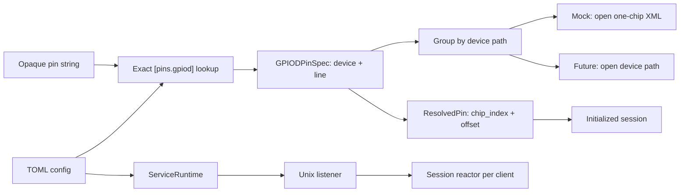

# Architecture Overview

The service is layered so the JSON protocol and session rules can run on a PC with the file-backed mock backend. The same pin map and `Backend` traits are intended for a future `libgpiod` implementation.

## Process bootstrap

- `src/main.rs` parses CLI (`--mock` and an optional config path), loads TOML, starts a multi-thread Tokio runtime, and calls `app::run`.
- `src/config.rs` discovers the file (positional path, then `GPIOJSONSVC_CONFIG`, then `gpiojsonsvc.toml`) and validates socket plus `[pins.gpiod]`.
- `src/app.rs` selects the backend. `--mock` constructs `MockBackend`; `GPIOJSONSVC_MOCK_LOG` also enables the XML write log. It then validates every mapped XML path and line and binds the Unix socket. Without `--mock`, it returns `real backend unavailable; use --mock` and does not bind.
- Stale socket files are removed before bind. On Ctrl-C the listener stops, live sessions are closed, and `BoundSocket` removes the socket path.

`AppConfig` / `ServiceConfig` do not encode the backend. Adding a real backend later should only change `select_backend` and the `open_chip` implementation.

## Layers

| Path | Role |
| --- | --- |
| `src/protocol/` | Request/response types, line parse/serialize |
| `src/transport/` | Unix `SOCK_STREAM`, `LinesCodec`, reader task |
| `src/session/` | Per-connection reactor, `init` compilation, get/set batches, sequences, events |
| `src/gpio/libgpiod.rs` | Trait surface modeled on libgpiod v2 |
| `src/gpio/mock/` | One XML file per chip, watchers, persistence |
| `src/gpio/sys.rs` | Stub for the real FFI backend |
| `src/error.rs` | Startup/runtime errors |
| `src/scheduler/` | Placeholder schedule-state enum; timed sets live in `src/session/sequence.rs` |

`src/_archived/` is leftover from an earlier design and is not linked into the binary.

## Pin resolution

1. Protocol `pin` is looked up with `SessionConfig::resolve_gpiod_pin` (exact string).
2. The mapped `device` is grouped in session-local `ChipIndices`. The first time a path appears it gets the next `chip_index`; later pins on the same path reuse it.
3. Mapped `line` becomes `ResolvedPin.offset`.
4. `backend.open_chip(device)` runs once per distinct device. In mock mode `device` is the XML path; later it will be the real device path.
5. Get/set/event routing uses `{chip_index, offset}` only. Combined targets pack bits in selector order (first pin is MSB).

The XML `id` is stored as chip metadata and is not a protocol pin key.

## Session reactor

Each accepted connection gets:

- a framed reader task that forwards `RequestMessage` values
- a `SessionReactor` that owns session state, GPIO watchers, and the response sink

States: `Connected` → `Initialized` (or `SetSequenceRunning`) → `Closing` / `Closed`.

After a successful `init`, the reactor:

- holds compiled targets and opened chips
- watches request fds for chips that have trigger lines
- on edge events, maps `(chip_index, offset)` to the trigger target name and writes `status: event`

Immediate `set` compiles a write batch and applies it, then replies `ok`. Stepped `set` compiles every step first, applies step 0 immediately, sleeps until each remaining accumulated lag, and replies `ok` after the last step is applied. Disconnect aborts watchers and drops the initialized session without restoring output defaults.

## Mock backend

`MockBackend::open_chip` loads one `<gpiochip>` document, keeps process-wide state keyed by file path, and persists line levels back to that file. Watchers observe file changes and line-request edge configuration. Multiple sessions that open the same XML path share that chip’s mock state; two different paths are independent chips. XML grammar: [mock_chip.md](mock_chip.md).

The mock is always compiled in. Gating it behind a Cargo feature is a later build/deployment change.

## Real backend (deferred)

`src/gpio/sys.rs` should implement the same `Backend` traits and `Drop` semantics as described in the libgpiod trait module. Until then, the no-`--mock` path is an explicit startup error.

## Debug client

`tools/debug_client.py` speaks the live protocol (`id` + `action`). Canned commands allocate increasing IDs. Correlation treats `status: event` as unsolicited even when the event reuses the `init` id. How to run it: [debug_client.md](debug_client.md).

## Deferred behavior

- Output-default values, sequence cancel policy, and restore-on-disconnect
- Process-wide shared-read / exclusive-write locks keyed by physical pin
- Software trigger filtering
- `libgpiod` FFI on Rock5B
- Optional feature-gate for mock code
