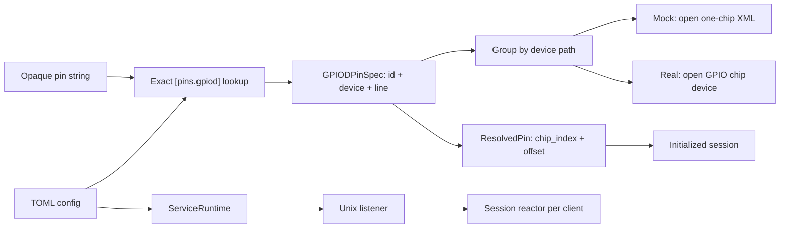

# Architecture Overview

The service is layered so the JSON protocol and session rules can run on a PC with the file-backed mock backend. The same pin map and `Backend` traits also support the real libgpiod 2.x backend on Linux.

```mermaid
flowchart LR
    pinString["Opaque pin string"] --> exactLookup["Exact [pins.gpiod] lookup"]
    configFile["TOML config"] --> exactLookup
    exactLookup --> location["GPIODPinSpec: id + device + line"]
    location --> deviceGroup["Group by device path"]
    deviceGroup --> mockSelect["Mock: open one-chip XML"]
    deviceGroup --> realOpen["Real: open GPIO chip device"]
    location --> resolvedPin["ResolvedPin: chip_index + offset"]
    resolvedPin --> initializedSession["Initialized session"]
    configFile --> runtime["ServiceRuntime"]
    runtime --> udsListener["Unix listener"]
    udsListener --> reactor["Session reactor per client"]
```

## Process bootstrap

- `src/main.rs` parses CLI (`--mock` and an optional config path), loads TOML, starts a multi-thread Tokio runtime, and calls `app::run`.
- `src/config.rs` discovers the file (positional path, then `GPIOJSONSVC_CONFIG`, then `gpiojsonsvc.toml`) and validates socket plus `[pins.gpiod]`. Each pin stores a required `u32` resource `id` equal to the GPIO index (the integer pin key in the board's `gpio.json`), for future occupation checks across features such as I2C. Current resolution and conflict checks still use `(device, line)`.
- `src/app.rs` selects the backend. `--mock` constructs `MockBackend`; `GPIOJSONSVC_MOCK_LOG` also enables the XML write log. Mock startup validates every mapped XML path and line. Without `--mock`, Linux uses `SysBackend` and validates each distinct mapped path as a GPIO chip device; other platforms reject real mode. The selected backend then serves the Unix socket.
- Stale socket files are removed before bind. A signal task translates SIGINT/SIGTERM into `SystemEvent::SHUTDOWN`; the listener and live sessions all stop on that event, and `BoundSocket` removes the socket path.

`ServiceConfig` stores the service and pin map; `AppConfig.mock` selects real or mock mode at runtime.

## Layers

| Path | Role |
| --- | --- |
| `src/protocol/` | Request/response types, line parse/serialize |
| `src/transport/` | Unix `SOCK_STREAM`, `LinesCodec`, reader task |
| `src/session/` | Per-connection reactor, `init` compilation, query collection, get/set batches, sequences, events |
| `src/gpio/mod.rs` | Trait surface modeled on libgpiod v2 |
| `src/gpio/mock/` | One XML file per chip, watchers, persistence |
| `src/gpio/sys/` | Real libgpiod 2.x FFI backend |
| `src/error.rs` | Startup/runtime errors |
| `src/scheduler/` | Placeholder schedule-state enum; timed sets live in `src/session/sequence.rs` |

`src/_archived/` is leftover from an earlier design and is not linked into the binary.

Protocol `init` and `set` objects deserialize into `protocol::common::ArrayMap`, a
contiguous `Vec<(K, V)>` representation. These payloads are iteration-only after
parsing, so the type preserves wire order and rejects duplicate JSON keys without
paying for tree lookup and mutation APIs that the session path does not use.

## Pin resolution

1. Protocol parsing converts each init expression key into a `PinSelector` storing the original string and pin end offsets in a `SmallVec<[usize; 8]>`. Up to eight pins keep their offsets inline; larger init groups spill the offsets to the heap. Its `parse`, `len`, `iter`, and `is_single` methods validate expressions and expose borrowed pin names without allocating per-pin strings. Each component is looked up with `SessionConfig::resolve_gpiod_pin` (exact string), and parameters are applied separately to each pin. Duplicate physical locations anywhere in init are rejected.
2. The mapped `device` is grouped in session-local `ChipIndices`. The first time a path appears it gets the next `chip_index`; later pins on the same path reuse it.
3. Mapped `line` becomes `ResolvedPin.offset`.
4. `backend.open_chip(device)` runs once per distinct device. In mock mode `device` is the XML path; in real mode it is the GPIO chip device path.
5. `CompiledPins` stores one `CompiledPin { mode, pin: ResolvedPin }` per initialized configuration key. Init group expressions are not retained.
6. Get/set use plain pin-name strings resolved directly against that per-pin registry. Each pin is checked for access mode; set values must be 0 or 1. Get collects one value per requested name without bit packing. Set maps reject duplicate keys while parsing. Per-chip batches retain the existing GPIO execution path. Different chips are applied sequentially, without cross-chip atomicity.
7. Init `initial` and `final` values are single bits broadcast to each pin. Final writes are compiled per pin and retained for graceful close.

The XML `id` is stored as chip metadata and is not a protocol pin key.

## Session reactor

Each accepted connection gets:

- a framed reader task that forwards `RequestMessage` values
- a `SessionReactor` that owns session state, GPIO watchers, and the response sink

States: `Connected` → `Initialized` (or `SetSequenceRunning`) → `Closing` / `Closed`.

After a successful `init`, the reactor:

- holds the compiled pin registry and opened chips
- watches request fds for chips that have trigger lines
- on edge events, maps `(chip_index, offset)` to the configured trigger pin name and writes `status: event`

Immediate `set` compiles a write batch and applies it, then replies `ok`. Stepped `set` compiles every step first, applies step 0 immediately, sleeps until each remaining accumulated lag, and replies `ok` after the last step is applied. Disconnect aborts watchers, applies any compiled output `final` values, then drops the initialized session.

## Query collection

`src/session/query.rs` reads the full pin map through `SessionConfig::gpiod_pins`.
For `query` with `target: "gpio"`, an absent `pin` selects all configuration keys;
a string/array selects exact names. The intended collection behavior (see
[docs/TODO](TODO) for the pending fix) is to resolve the entire selection before GPIO I/O
and collapse repeated names. Open each selected device once and obtain one fresh
`Chip::get_line_info` snapshot per distinct `(device, line)`. Selected aliases
retain their individual configuration IDs while sharing observed metadata.

Query is independent of initialization and never requests lines or modifies the
compiled session registry, watchers, or pending set sequence. It returns one
typed `query_result` with a lexically ordered `pins` map, or one contextual error.
Collection is synchronous like existing GPIO operations; it and response writes
can delay the same reactor's timer handling. The aggregate snapshot is not atomic
and does not reserve free pins. Successful get replies use `get_result` with the
existing scalar/array value payload.

## Mock backend

`MockBackend::open_chip` caches one `MockChip` per exact device path under a
synchronized registry shared by backend clones. The first open loads the XML
and starts one polling watcher; subsequent opens reuse that state and watcher.
Multiple service sessions therefore observe the same active request registry,
usage/consumer metadata, and exclusive line ownership. Independent backend
instances and different paths remain isolated. Requests release ownership when
dropped; cached snapshots/watchers remain until backend/handles are dropped.
Query reads this state without XML writes or write-log entries. External edits
update input levels through polling, not cached metadata/structure. XML grammar:
[mock_chip.md](mock_chip.md).

The mock is always compiled in. Gating it behind a Cargo feature is a later build/deployment change.

## Real backend

`src/gpio/sys/` implements the traits in `src/gpio/mod.rs` using libgpiod 2.x FFI. Its wrappers release chips, requests, settings, and event buffers through `Drop`. On Linux this backend is selected when `--mock` is omitted. Build requirements are listed in [README.md](../README.md#build).

## Debug client

`tools/debug_client.py` speaks the live protocol (`id` + `action`). Canned commands allocate increasing IDs. Correlation treats `status: event` as unsolicited even when the event reuses the `init` id. How to run it: [debug_client.md](debug_client.md).

## Deferred behavior

- Sequence cancel policy
- Process-wide shared-read / exclusive-write locks keyed by physical pin
- Software trigger filtering
- Optional feature-gate for mock code
